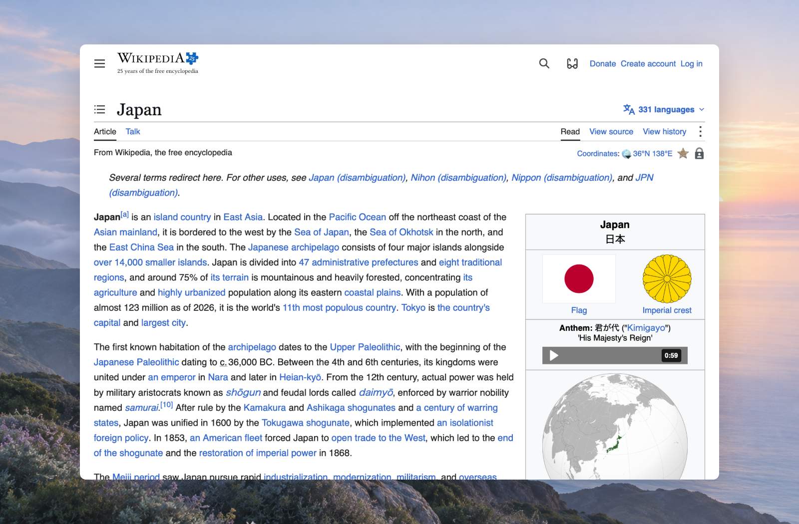
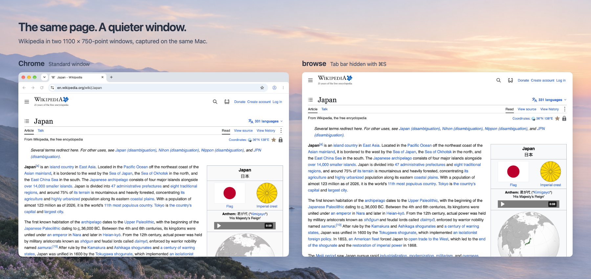
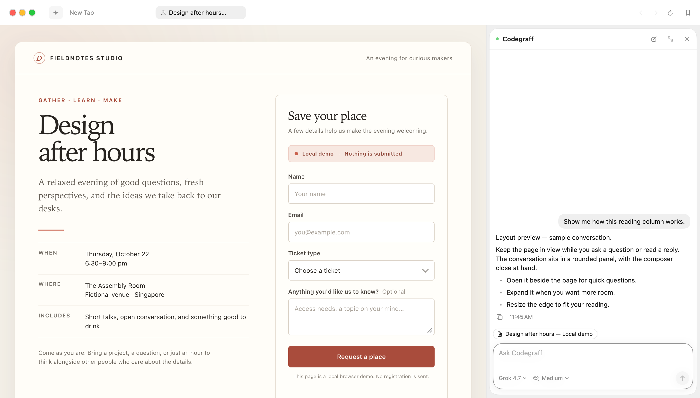

# browse

**A quieter browser for the Mac, with Codegraff beside the page.**

browse is a small WebKit browser for reading, searching, and getting things done. Keep the page in view while [Codegraff](https://github.com/justrach/codegraff) researches a question, follows links, or helps with a form.

**[Download browse for macOS](https://github.com/justrach/browse/releases/latest)** · macOS 14 or later · signed and notarized



## Room for the page

The tabs and the page are the whole window. Press **⌘L** for an address or search, **⌘K** to find an open tab, or **⇧⌘R** for reading mode. Put tabs across the top or down the side; pin the ones you keep, and idle tabs sleep to free memory.

The things you expect from a browser are here too: blocking for ads and trackers before pages load, picture-in-picture video, passwords in your Mac keychain, and Chrome extensions on macOS 15.4 or later. Peek, a bookmarks bar, and a small window for links from other apps are available in Settings when you want them.

Press **⌘S** to hide the tab bar or sidebar and give the page the whole window. Rest the pointer at the top or left edge to bring tabs back temporarily; press **⌘S** again to keep them visible. **⌘L** still opens the address and search field. You can also set the sidebar to tuck itself away in Settings › Tabs.

### Beside Chrome

The same Wikipedia page in two equally sized windows: Chrome with its standard tabs and address bar, and browse with the tab bar hidden using **⌘S**. [How the images were captured](docs/images/README.md).



## Ask, without leaving

The Ask tab gives Codegraff a place for a question or a task, with a choice of models from your Codegraff account. Ask about the page you're reading with **⇧⌘A**, or press **⌘↩** in the address field to send the page with your question. The conversation can stay in a column next to the site, with its answer and sources in sight.



*The rounded column in the upcoming build, with a sample conversation beside a local demo form.*

Codegraff can read and fill a form on your tab, then leave you to review it; it is instructed to ask before sending a payment, post, booking, or signup. [See a filled event form](docs/screenshots/event-registration-window.png) (local demo; nothing submitted). [Capture notes](docs/images/README.md).

## Make it feel like yours

Choose a light or dark look in Settings › Themes: browse, Codegraff, Codegraff Paper, Nord, or Forest. You can also describe a theme to Codegraff, import one from a JSON file, or edit one yourself. [See the theme picker](docs/screenshots/themes.png).

Sign in with your Codegraff account to use the agent. It is the same account used by `graff` in your terminal. When Codegraff's sync server supports it, you can switch on end-to-end encrypted sync for bookmarks, history, and themes; the sync key stays with your Macs and moves to a new Mac through a sync code. Settings › Sync shows when the service is available.

## What leaves your Mac

- Questions you send to Codegraff, and page text when you ask about a page, go to the model provider your Codegraff account uses. When Jev handles a step, the page's visible words and controls go to Jev through Codegraff. Password fields are excluded.
- If you turn on sync, encrypted bookmarks, history, and themes go to Codegraff's server.
- Anonymous device and memory statistics are optional and off by default in Settings › Privacy. You can see the [aggregate statistics](https://search-codegraff-stats.rachpradhan.workers.dev).
- The daily update check asks GitHub for the latest release. An update is installed for the next launch only after browse checks that it is newer and signed by the same developer.

Codegraff runs as the `graff` command on your Mac, installed by the Codegraff app. It can run commands and edit files as well as use the browser, without a permission prompt for each action. You can switch the agent off in Settings › Agent.

## Size and memory

Measured on one Mac with equal 1100 × 750 windows, including each browser's helper processes:

| Local test | browse | Chrome |
| --- | ---: | ---: |
| One page | 186 MiB | 340 MiB |
| Ten mixed pages | 289 MiB | 701 MiB |
| 30 seconds after closing nine mixed pages | 298 MiB | 761 MiB |

The first two rows are physical-footprint medians sampled at 140, 145, and 150 seconds. browse kept four of the ten tabs awake; its mixed-workload samples ranged from 288 to 718 MiB. These are synthetic-workload observations from one run per browser, with default tab management enabled.

The installed app bundles occupied **9.38 MiB for browse and 2.09 GiB for Chrome**. browse uses macOS's shared WebKit; Chrome bundles its engine and both CPU architectures. Those disk figures exclude profiles, caches, system WebKit, and the separate Codegraff installation.

[Full RAM and app comparison](docs/performance.md) includes the workloads, raw readings, limitations, feature differences, and the next steps for making browse lighter. Both browsers are free to download; agent usage has separate terms. Page speed has not been established by these measurements.

## Build from source

You need macOS 14 or later and Xcode 16.

```sh
swift build        # SwiftPM executable
./build.sh         # build/browse.app, signed for this Mac
open build/browse.app
```

`./fresh.sh` starts a copy with its own profile. `./bench --test` drives that test copy from the shell; see [browse-bench](skill/browse-bench/SKILL.md). The SwiftUI and AppKit source lives in `Sources/Browse/`.

Contributions are welcome; read [CONTRIBUTING.md](CONTRIBUTING.md) first. [Release notes](CHANGELOG.md), the [roadmap](ROADMAP.md), and [release process](docs/releasing.md) have more detail.

## Current limits

- Passkeys depend on Apple granting browse the browser passkey entitlement and signing the app with it. See [releasing.md](docs/releasing.md).
- Sync needs Codegraff's server to support it. Until then, Settings › Sync says so.
- Versions before 1.0.2 need one manual download to start receiving automatic updates.

## License

browse is a Codegraff product under [AGPL-3.0](LICENSE). Earlier code retains its original owner's [MIT license and copyright notice](LICENSE.MIT). The Jev step code adapts Browser Use's jev-ultrafast (MIT).
