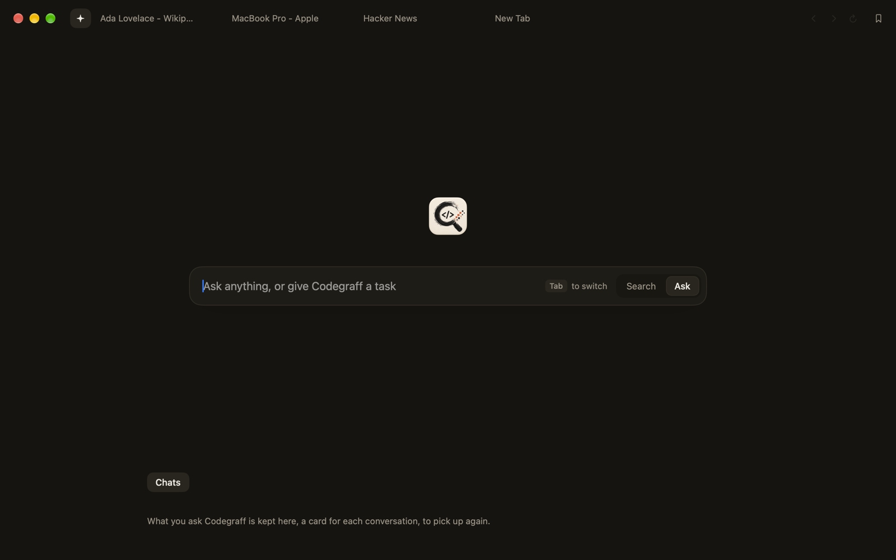
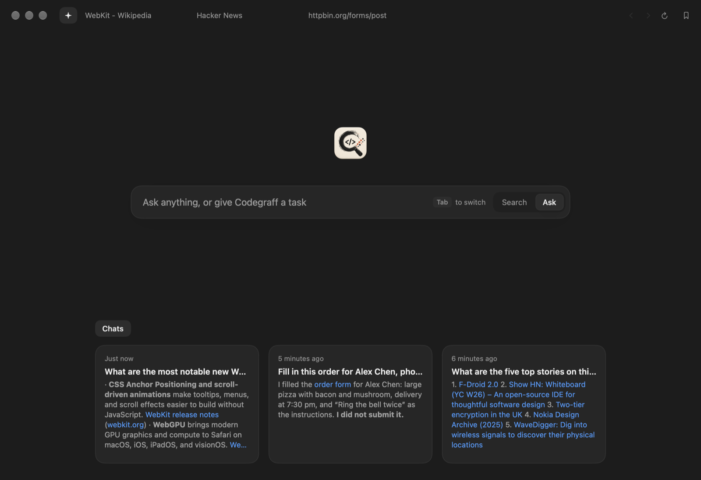
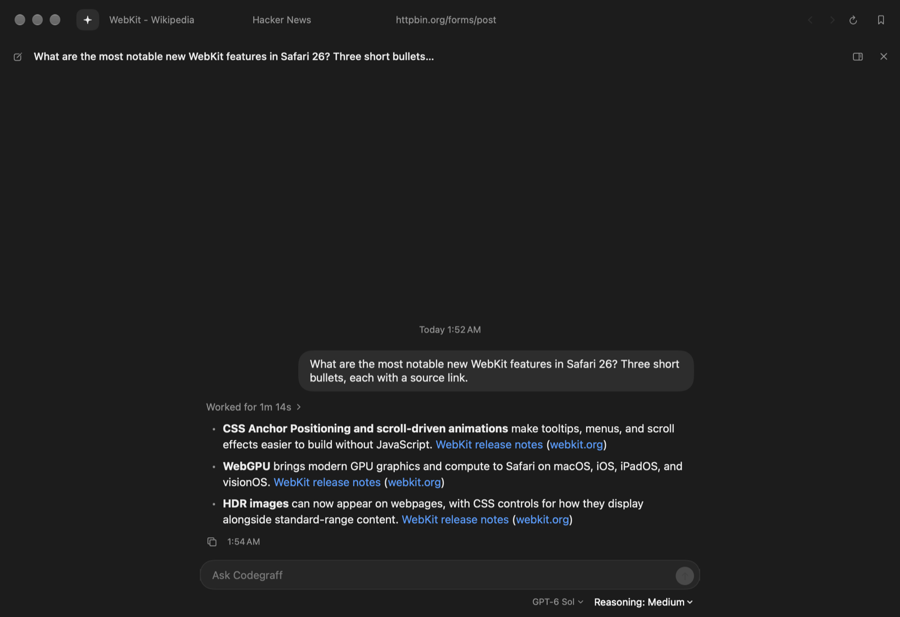
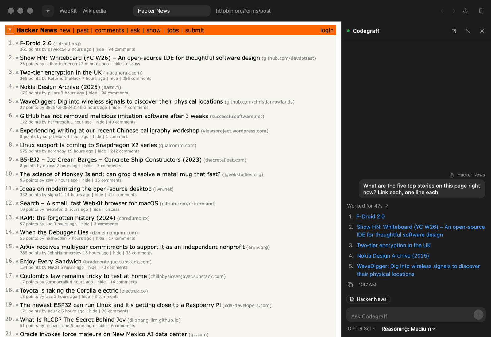
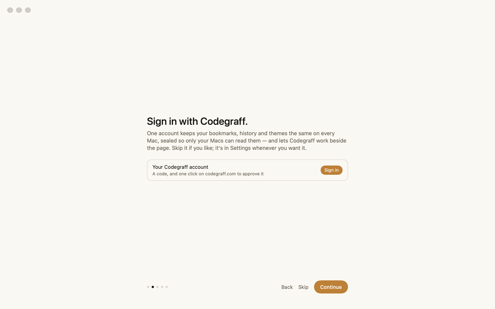
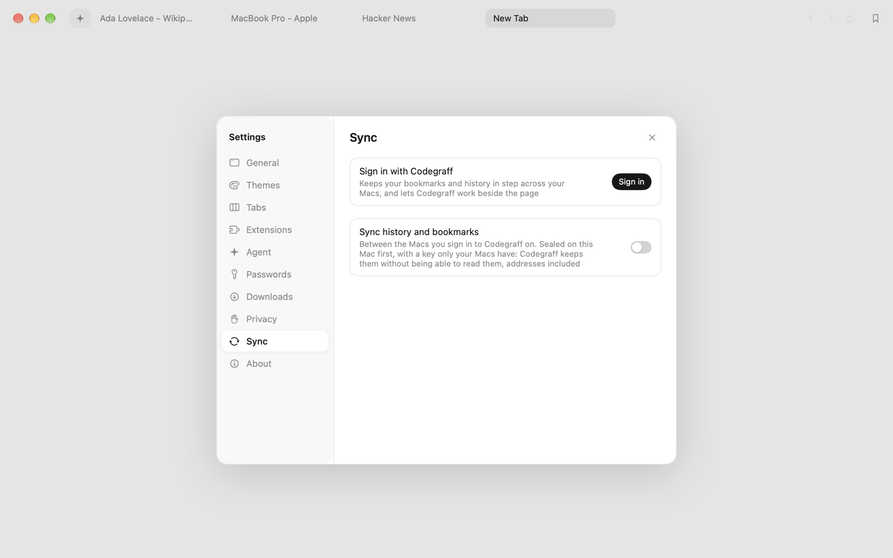

# browse


A small, fast browser for the Mac, with [Codegraff](https://github.com/justrach/codegraff) beside the page. Read, search, and ask about what you're reading; have Codegraff research something, fill in a form, or make you a theme from a sentence. Your bookmarks, history and themes follow you between Macs, sealed so only your Macs can read them.

**[Download for macOS](https://github.com/justrach/browse/releases/latest)** · macOS 14 or later · signed and notarized · it keeps itself up to date


## The browser

Tabs and the page, and nothing else in the way.

- **One field.** ⌘L to type an address or a search; it finishes addresses from your own history. ⌘K switches to a tab you already have open.
- **Tabs your way.** Across the top or down the side. Pin the ones you keep all day; tabs you haven't looked at in a while sleep and give their memory back.
- **Built in, not bolted on.** An ad and tracker blocker that runs before the page loads, reading mode (⇧⌘R), video that floats above everything (⇧⌘P), and ⇧⌘H to hide anything on a site for good.
- **Passwords in your keychain,** offered once a sign-in has actually worked.
- **Chrome extensions** from the Chrome Web Store, on macOS 15.4 or later.
- **Peek, a bookmarks bar, a small window for links from other apps** — shift-click a link to look at it without leaving the page; each of these is off until you turn it on in Settings.
- **Small.** It runs on WebKit, the engine already in macOS, so the app is a few megabytes and opens at once.

## Themes

Pick how it looks in Settings › Themes: browse's own white and greys, **Codegraff** (the Codegraff app's warm graphite and amber), **Codegraff Paper** (codegraff.com's paper, ink and coral), Nord or Forest — each for light and for dark.


Or describe one. Say what it should feel like and Codegraff picks the colours for light and dark, checks every one reads, and switches to it.


A theme is a small JSON file — add one from a file, share yours, or open the themes folder and edit one by hand. The ones you add or make sync to your other Macs.



## Codegraff, beside the page

The sparkle at the head of the tab row is the Ask tab: one field that asks Codegraff anything (Tab switches it to a plain search), and your conversations so far, each a card you can pick back up.



A conversation reads like a page of its own: what you asked, the work folded into one line that opens to every step, and the answer with its sources.



Ask about the page you're on with ⌘↩ in the address field or ⇧⌘A, and the page goes along with the question. Keep the talk in a column beside the page if you'd rather see both.



It uses the browser too: search, read many pages at once, click, type, and **fill in forms**. It reads a form the way you do — labels, choices, what's required — and fills it in on your tab in front of you. It's told to ask before sending anything that pays, posts, books or signs you up; check what it filled before anything that matters goes.


For work of many small steps — a search with its filters, a date picker — Codegraff hands the clicking to [Jev](https://docs.typesafe.ai/introduction), the way Browser Use's [jev-ultrafast](https://github.com/browser-use/jev-ultrafast) does: one quick call a step picks the action and the element, about half a second each. Codegraff's model still plans the task and says what gets typed; Jev makes nothing up.

The model picker under the field searches every model your Codegraff account reaches.

## Your Codegraff account, and sync

Sign in once — on the welcome screens, or in Settings — with a code and one click on codegraff.com. That one sign-in is what Codegraff, Jev and sync use, and it's the same one `graff login` makes, so the graff in your terminal is signed in too.



Switch on sync in Settings › Sync and your history, bookmarks and themes are the same on every Mac you sign in on. Everything is **sealed on your Mac** before it leaves, with a key only your Macs hold — you carry it to the next Mac as a sync code — so Codegraff stores it without being able to read it, not even the addresses. Forget a page or clear your history, move or delete a bookmark, and it happens everywhere. Settings › Sync can also delete everything synced from Codegraff's server.



## Updates

browse checks for a new version once a day, fetches it quietly, checks it's this app, newer, and signed by the same developer, and has it ready the next time you open it — or now, with Relaunch in Settings › About. Nothing you've set is touched.

## What leaves your Mac

- What you type to Codegraff, and the text of the page when you ask about it, go to the model provider your Codegraff account uses. When Jev takes the steps, the page's visible words and controls go to Jev through Codegraff. Password fields never go.
- With sync on, your history, bookmarks and themes go to Codegraff sealed, as above.
- With anonymous stats on (Settings › Privacy, off by default): this Mac's chip, cores, memory and macOS version, and how much memory the app uses — under a random id, [added up here](https://search-codegraff-stats.rachpradhan.workers.dev).
- The daily update check asks GitHub for the latest release.

Nothing else. Codegraff doesn't ship inside the app: it runs the `graff` command already on your Mac (the one the Codegraff app installs), and it acts without stopping to ask before each step, commands and file edits included — treat it as you would any agent with those powers. Turn it all off in Settings › Agent.

## Known limits

- Passkeys aren't available yet: they wait on Apple granting browse the browser passkey entitlement (docs/releasing.md).
- Sync needs Codegraff's server to support it; until it does, Settings › Sync says so.
- Versions before 1.0.2 don't check for updates; they need the next one downloaded by hand, once.

## Build it yourself

macOS 14 or later and Xcode 16.

```sh
swift build              # the SwiftPM executable
./build.sh               # build/browse.app, signed for this Mac
open build/browse.app
```

`./fresh.sh` opens a copy with a profile of its own, apart from the one you browse with, and `./bench` drives a running copy from the shell (Settings › General › "Let a script drive browse"); see `skill/browse-bench/SKILL.md`. The code is SwiftUI and AppKit in `Sources/Browse/`.

Releases come from CI: `./release.sh 1.0.2 "What's new."` tags a version, and a GitHub Actions workflow builds, signs, notarizes and publishes it — which is also how every installed copy gets it. [docs/releasing.md](docs/releasing.md) has the details, [AGENTS.md](AGENTS.md) the rules for working here.

## License

browse is a Codegraff product released under [AGPL-3.0](LICENSE). Code from before the Codegraff work remains its original owner's under its [MIT license and copyright notice](LICENSE.MIT); the Jev step code adapts Browser Use's jev-ultrafast (MIT).
