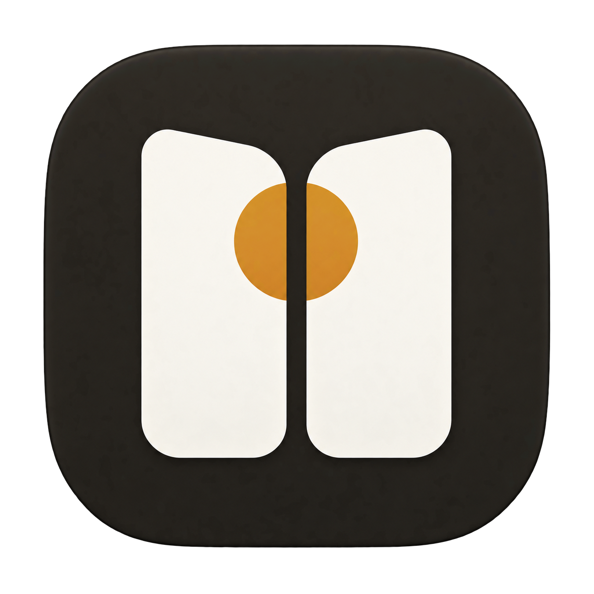
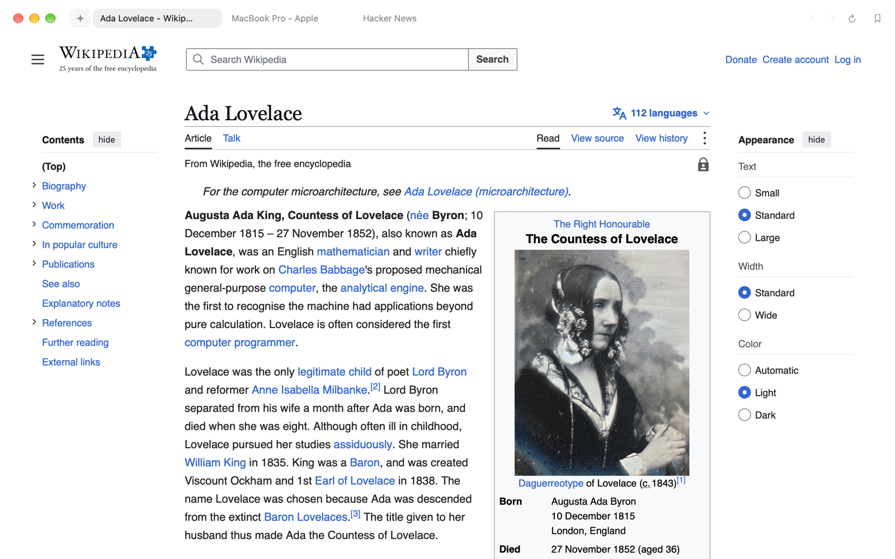
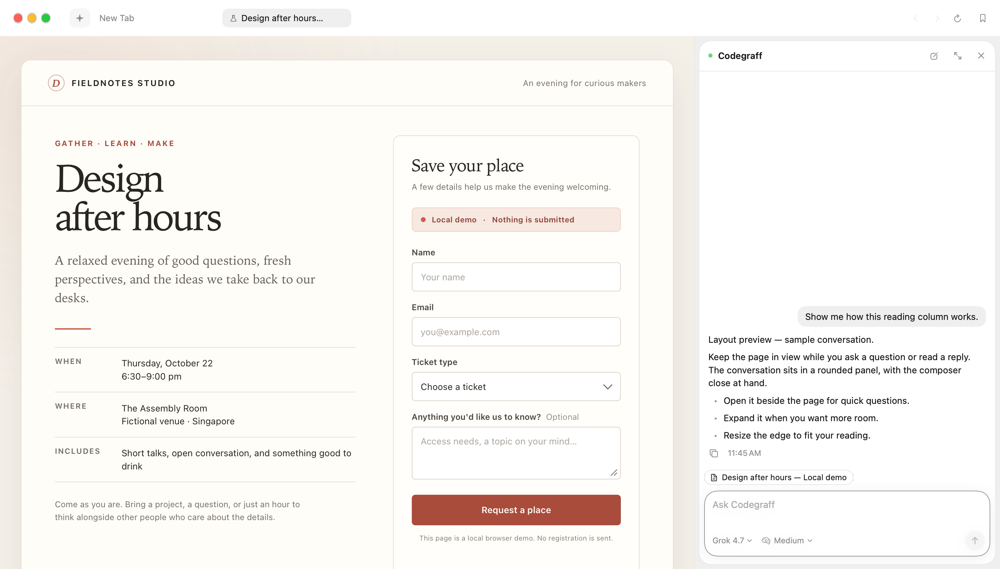

<p align="center">
  
</p>

<h1 align="center">browse</h1>

<p align="center">
  More room for the web.<br>
  A small browser for the Mac, with <a href="https://github.com/justrach/codegraff">Codegraff</a> close by when you want a hand.
</p>

<p align="center">
  <strong><a href="https://github.com/justrach/browse/releases/latest">Download for Mac</a></strong> · macOS 14 or later · free
</p>



<p align="center"><a href="https://github.com/justrach/browse/raw/refs/heads/main/docs/videos/browse-demo.mp4">Watch the demo →</a></p>

## The page first

The tabs and the page are the whole window. **⌘L** to go somewhere, **⌘K** to find a tab, **⌘S** to hide the tabs altogether, **⌘D** for two pages side by side.

- WebKit, the engine already in your Mac: a 9 MB app, and [about half Chrome's memory](docs/performance.md).
- Ads and trackers blocked before pages load. Idle tabs sleep.
- Passwords in your Mac's keychain. Chrome extensions on macOS 15.4 or later.
- Bookmarks, history and passwords come over from Chrome, Arc, Brave, Edge, Firefox and others in one step.

## Codegraff, beside the page

Ask about the page you're reading with **⇧⌘A**, or type a question in the address field and press **⌘↩**. Codegraff answers in a column beside the site, and can fill in a form for you to check — it doesn't submit, pay or send anything unless you ask.



It needs the [Codegraff app](https://github.com/justrach/codegraff) and a Codegraff account. You can switch it off in Settings › Agent.

## What leaves your Mac

Only what you ask for. A question, and the page you ask about, go to Codegraff. Google's suggestions, if you turn them on, see what you type in the address field. Sync, if you turn it on, sends your things sealed with a key only your Macs have. [Where your things go](docs/your-data.md) has the details.

## Build it

macOS 14 or later and Xcode 16.

```sh
./build.sh            # build/browse.app, signed for this Mac
open build/browse.app
```

[CONTRIBUTING.md](CONTRIBUTING.md) is where to start. The [changelog](CHANGELOG.md) says what's new.

## License

[AGPL-3.0](LICENSE). browse began as a fork of [Search](https://github.com/driceroland/Search) by Office Commun; the code it inherited keeps its original [MIT notice](docs/legal/upstream-mit.txt), which doesn't extend to new browse work. The Jev step code adapts Browser Use's jev-ultrafast (MIT).
